# Foodstagram

## Description
For my final project, I was tasked with building an app using a PostgreSQL database, the Django web framework, a REST API, and a React frontend. I chose to work on my own and decided to build an app with a design similar to Instagram, but dedicated to food. I creatively named this app Foodstagram.

On this app, any user would be able to browse recipes in the feed, add recipe ingredients to the shopping list component, and use the fridge component to search for recipes based on selected ingredients. If a user was registered and logged in, they would be able to post recipes, edit and delete their own recipes, and like recipes uploaded by others.

I recognised that implementing this level of functionality was quite ambitious for a solo project within the given 12-day timeframe, but I was eager to challenge myself and believed it was possible.

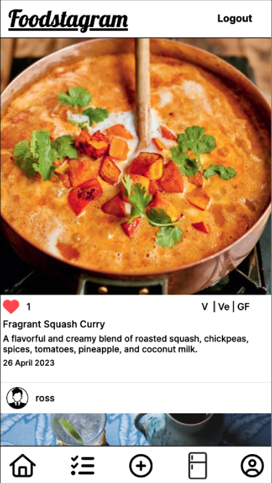

## Deployment Link
https://ross-recipe-app.herokuapp.com/

## Timeframe & Working Team
I received the project brief at 14:00 on April 12th 2023, and had to present my work in the afternoon of April 24th 2023. For this project, I chose to work independently.

## Technologies Used
* Django
* Django REST framework
* Python
* JavaScript/JSX
* React
* SASS/CSS
* HTML
* Git/GitHub
* Trello
* TablePlus
* QuickDBD
* Excalidraw

## Brief
Technical Requirements

You must:
* **Build a full-stack application** by making your own backend and your own front-end
* **Use a Python Django API** using Django REST Framework to serve your data from a Postgres database
* **Consume your API with a separate front-end** built with React
* **Be a complete product** which most likely means multiple relationships and CRUD functionality for at least a couple of models
* **Implement thoughtful user stories/wireframes** that are significant enough to help you know which features are core MVP and which you can cut
* **Have a visually impressive design** to kick your portfolio up a notch and have something to wow future clients & employers. **ALLOW** time for this.
* **Be deployed online** so it's publicly accessible.

Necessary Deliverables

* A **working app** hosted on the internet
* A **link to your hosted working app** in the URL section of your Github repo
* A **git repository hosted on Github**, with a link to your hosted project, and frequent commits dating back to the _very beginning_ of the project
* **A `readme.md` file** with:
    * An embedded screenshot of the app
    * Explanations of the **technologies** used
    * A couple paragraphs about the **general approach you took**
    * **Installation instructions** for any dependencies
    * Link to your **user stories/wireframes** – sketches of major views / interfaces in your application
    * Link to your **pitch deck/presentation** – documentation of your wireframes, user stories, and proposed architecture
    * Descriptions of any **unsolved problems** or **major hurdles** you had to overcome

## Planning
As I wanted to incorporate a lot of functionality into this app, the first step I took was to determine which features should be included in the minimum viable product (MVP) and which ones could be considered for implementation post-MVP. Please see the list below.

### MVP:
* Recipes; this section is like a feed and should serve as inspiration
    * Users can like recipes
    * Display dietary flags
* Ingredients and functionality to add them to a shopping list
* Shopping list
    * Add remove single/multiple items
    * View recipes added to the list
* Fridge: Look up recipes based on selected ingredients
* Post a recipe
* Edit/Delete owned recipes

### Post MVP:
* Find alternatives if ingredients out of stock
* Filters:
    * Vegetarian, vegan, gluten free
    * Continents - try something new
    * Nutrition
* Users can upload money saving 'hacks'
* Nutrition section
* Prices of foods; price of meal + price to buy ingredients

I then created a wireframe using Excalidraw. This helped me to visualise how the app would be structured. See below a screenshot of the wireframe I produced for this app.

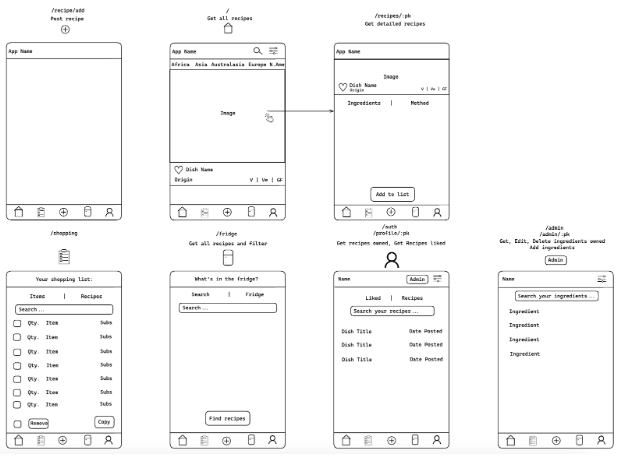

My app would open on the feed page, where users could scroll through recipes posted by other users. By clicking on a recipe image, users would be able to access the detailed recipe page. On this page, they would see the recipe method and ingredients, and have the option to add the ingredients to their shopping list. Logged in users would also have the ability to like recipes from both the home page and the recipe detailed page.

The app would feature a navbar at the bottom of the window, providing routes to the home, shopping list, add recipe, fridge, and profile pages. On the shopping list page, users would be able to view and remove ingredients or recipes they have added to their shopping list. Logged in users would have access to the post recipe page, which would display a form for them to complete in order to post a recipe. The fridge page would allow users to add items they want to have in their virtual 'fridge', and the app would suggest recipes based on those items. The profile page would only be accessible to logged in users, where they could view recipes they own or have liked.

To visualise the structure and relationships of my database models, I created a database diagram using QuickDBD. Please refer to the diagram below:

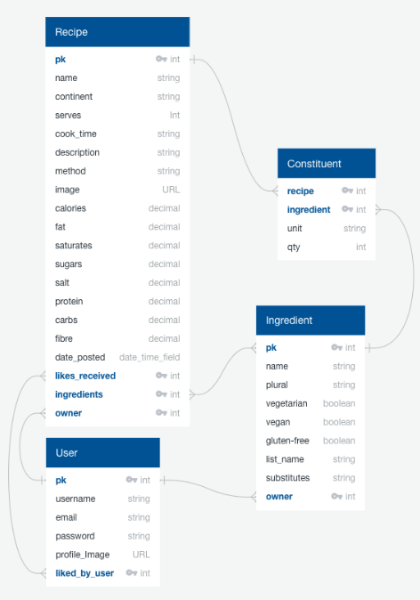

In the diagram, it is evident that I intended to include four models in my app: user, recipe, constituent, and ingredients. The relationships between these models are as follows:

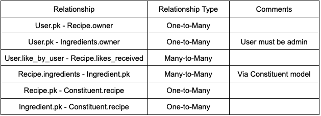

To achieve the desired output and querying capabilities on the front-end, I utilised the `through` argument and created a constituent model. This intermediary model facilitated the connection between the recipe and ingredient models, allowing me to store additional information about the ingredients for a specific recipe, such as the unit and quantity.

Furthermore, I carefully planned small sprints and established realistic timeframes to accomplish them using a Trello board.

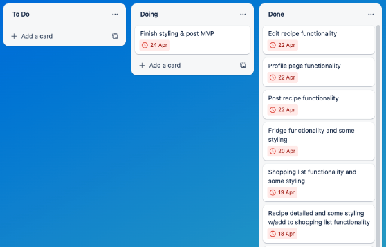

## Build Process: Back-end
I started building several models in the back-end, including the `User` model by extending Django's built-in `AbstractUser`, as well as the `Ingredient` and `Recipe` models. I also set up URL patterns, serializers, and views for these models.

Developing the `Recipe` model was an interesting learning experience, as it required the use of the `Constituent` model as an intermediary through the `through` argument. This allowed me to store the quantity and unit data of the ingredients specific to each recipe. Additionally, I implemented three computed properties on the `Recipe` model to determine the vegan, vegetarian, and gluten-free statuses of recipes based on their underlying ingredients. Please refer to the `Recipe` and `Constituent` models below:

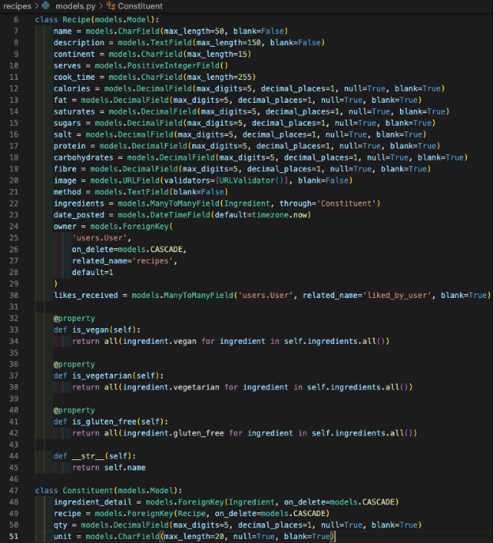

The structure of the `Recipe` model posed interesting challenges when creating a serializer to store data in the database. To accommodate both the input of data from the front-end and the database storage requirements, I defined a `ListField` for the `ingredients` field, which consists of a list of ingredient dictionaries. Additionally, I set the `ingredients` field to be write-only to exclude it during serialization of existing `Recipe` instances.

For creating a new `Recipe` instance from the validated data, I utilised the `create` method. This method extracts the `ingredients` data, iterates over each ingredient dictionary in `ingredients_data`, retrieves the corresponding `Ingredient` instance from the database using the `ingredient_detail` field, and obtains the `qty` and `unit` fields. Subsequently, a new `Constituent` instance is created to associate the ingredient with the recipe. Please refer to the `CreateRecipeSerializer` below:

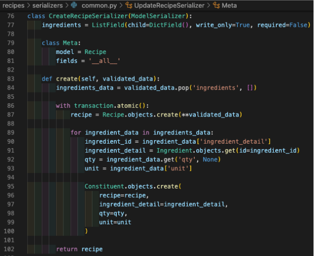

I implemented a custom authentication class called `JWTAuthentication` for back-end authentication using Django REST Framework. This class extends the `BaseAuthentication` class and overrides its `authenticate` method to generate a JSON Web Token upon successful authentication. Please refer to the code snippet below:

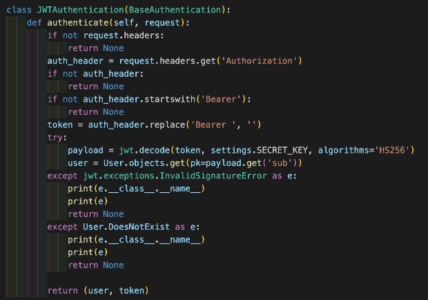

## Build Process: Front-end (React.js)
I utilised React hooks to declare state variables and leveraged Axios to fetch data from the backend API across the front-end. This combination allowed me to seamlessly import data from the back-end into the corresponding front-end pages.

### Home page:
One of the more challenging aspects of the Home page was managing the liking and 'unliking' of recipes by users. To achieve the desired functionality, I implemented a `handleLike` function. This function takes the `id` of the recipe being liked and performs the following actions: first, it checks if the `likes` state variable includes the `id` of the recipe. If the `id` is present, the function removes it from the `likes` state variable and decreases the like count for the recipe in the `likesReceivedCounts` state variable. Conversely, if the `id` is not already in the `likes` state variable, the function adds it to the `likes` state variable and increases the like count for the recipe in the `likesReceivedCounts` state variable. Finally, the function calls the `postLike` function with the `id` of the recipe being liked, sending a POST request to the API to update the like status. Please refer to the `handleLike` function below:

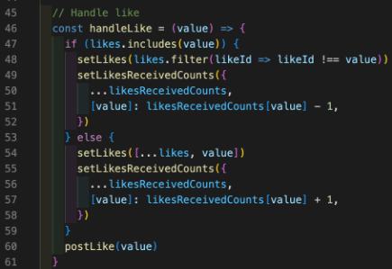

To display the information on the Home page, I utilised the `map` method to iterate over each recipe in the `recipes` state variable. For each recipe, I included a button to like or 'unlike' it. If the user is not authenticated, the button is disabled.

### RecipeDetailed page:
On the RecipeDetailed page, I implemented similar rendering and like functionality as the Home page. However, I utilised the `useRef` hook to reference the HTML elements for the recipe's method and ingredients. This allowed me to toggle the visibility of the ingredients or method sections using buttons within the `handleShowIngredients` and `handleShowMethod` functions. Please refer to the code snippet below:

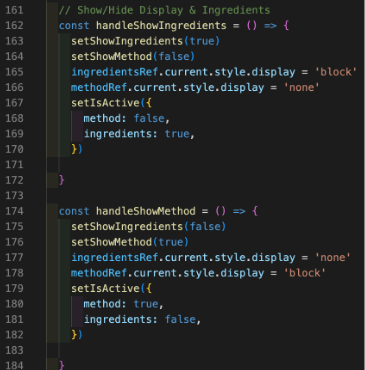

I also added functionality that allows users to add the ingredients of a recipe to their shopping list. The function maps over each ingredient in the recipe, creating an object containing its details, and checks whether it already exists in the user's shopping list. If it does, the quantity of that item is updated. If it doesn't exist, the new ingredient object is added to the list. Finally, with the use of a standalone `useEffect`, the updated list can be saved to `localStorage` for access on other pages.

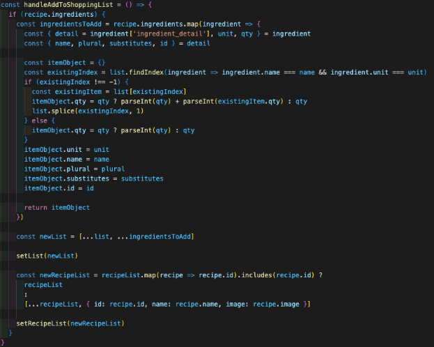

### Profile page:
On the profile page, I utilised the `map` method to render the data of recipes owned and liked by the authenticated user. I included buttons that allow the user to toggle between viewing their owned recipes and liked recipes, similar to the functionality on the recipe detailed page.

### Add/Edit Recipe pages:
The most challenging aspect of the Add & Edit Recipe pages was the creation of the ingredient arrays. My solution is in the below code snippet: 

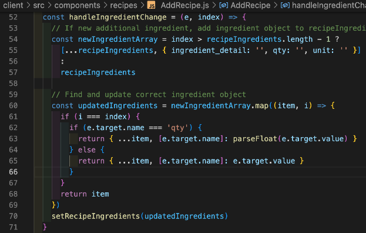

The function begins by creating a new array of ingredients with the updated values. If a new ingredient is being added, a new empty ingredient object is created and appended to the end of the array.

Next, the function locates the correct ingredient object within the array and updates its value based on the `name` attribute of the target input field. If the name is `qty`, the value is parsed into a float before being assigned.

Finally, the updated ingredients array is set as the new state using the `setRecipeIngredients` function.

### Shopping page:
On the Shopping page, data is retrieved from local storage upon mounting and saved to a state variable. The shopping and recipe lists are then rendered using a `map` method. Additionally, users can select and remove specific items from the shopping list by utilising a combination of `filter` and `findIndex` methods. The updated arrays are saved to the state and local storage for persistence.

### Fridge page:
The Fridge page incorporates three toggle-able views: Ingredients, Fridge, and Recipes. Upon mounting, the page retrieves all ingredient data from the database through a GET request. The data is rendered using a `map` method. 

To handle recipe lookup, a state variable is updated whenever the user modifies their fridge contents. Subsequently, a POST request is sent to the API with this data. The API filters and returns recipe data that includes all the ingredients currently present in the user's fridge.

## Build Process: Styling
I maintained minimal styling to ensure that the images uploaded by users remain prominent. To achieve this, I opted for a minimalistic design approach. Additionally, I utilised flexbox as it offers flexibility and efficiency in creating responsive designs.

## Challenges
Building my first solo full-stack project was a challenging experience. I encountered difficulties in various aspects, including data gathering, backend development, and frontend development. However, the most significant challenge I faced was building the serializer for creating recipe instances in the database.

To address the input and storage requirements, I implemented a solution using a `ListField` for the `ingredients` field, which contains a list of ingredient dictionaries. Additionally, I set the `ingredients` field to be write-only to exclude it during serialization of existing `Recipe` instances.

In the `create` method of the serializer, I processed the validated data and extracted the ingredients` information. I then created new `Constituent` instances to associate each ingredient with the recipe.

Overall, the `CreateRecipeSerializer` played a crucial role in allowing the creation of new recipe instances with associated ingredients in the database. The `CreateRecipeSerializer` is shown below:

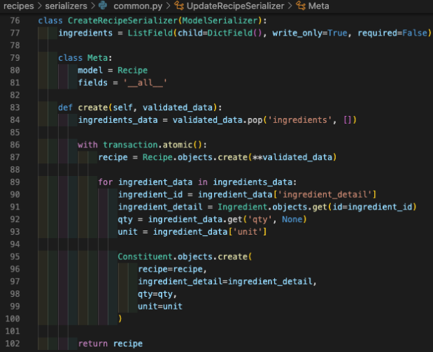

## Wins
The serializer for creating new recipe instances was a significant achievement and a standout feature of the project. It presented a challenging task that required independent research and problem-solving. The post recipe functionality, powered by the serializer, plays a crucial role in the success of the site as a recipe discovery platform.

Furthermore, I'm pleased to hear that the mobile view of the site looks great and that the fridge and shopping list pages function well. It demonstrates the successful implementation of these features and their usability for users.

## Key Takeaways
Throughout this project, I made an effort to incorporate more functionality than was realistically achievable within the available time frame and the data gathering requirements. Going forward, I have learned the importance of setting more realistic expectations for my workload. Nevertheless, I am proud of the significant progress I made and the accomplishments achieved. I thoroughly enjoyed the challenges that arose when adding various features to the project.

## Bugs
When posting recipes, I am aware of a few potential issues that could cause problems for the user. Firstly, the app currently allows users to enter the same ingredient multiple times, resulting in duplicate items when the recipe is added to the shopping list. This can lead to confusion and clutter in the shopping list, and should be addressed to improve the user experience.

Additionally, the app currently allows users to add tinned foods with weights specified, ideally it would only allow a integer units.

## Future Improvements
There are a number of things I would like to add in future including: 
* Display error messages when invalid login, registration, post recipe, edit recipe, delete recipe and like attempt is made
* Componentise the handle like function, filters and forms
* Improve desktop view
* Add filters to improve searchability and discoverability
* Show alternatives on shopping list
* Users can upload money saving 'hacks'
* Nutrition section
* Prices of foods; price per serving + price to buy ingredients

The data is already in the database for many of these features, I simply didn’t have time to implement them prior to submission.